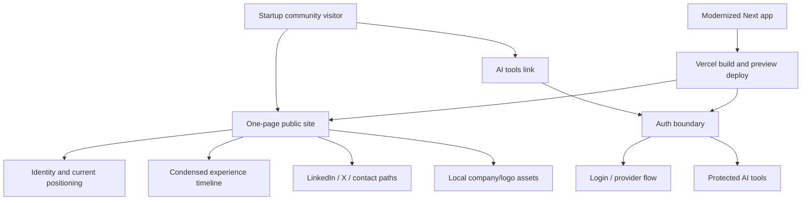

# refactor: Modernize and uplift personal site

## Summary

Modernize the personal site from its older Pages Router/Yarn-era shape into a current, Vercel-compatible Next.js app with a polished one-page public experience. The implementation should be willing to rebuild the public surface from scratch where that is cleaner than preserving legacy components, while preserving the authenticated AI tools boundary and the content that still matters.

---

## Problem Frame

The current site works enough to build, but it no longer supports the strategy: it is split across simple About and Resume pages, uses brittle remote LinkedIn logo assets, breaks horizontally on mobile, and sends the protected AI tools route into a local NextAuth configuration error when auth env vars are absent. The uplift needs to make the site feel current, minimal, and credible while reducing the maintenance burden of an old stack.

---

## Requirements

- R1. The public site presents who Adolfo is, what he has done, and where to find him in one polished, single-scroll experience.
- R2. The implementation modernizes the stack around current Next.js, React, TypeScript, Tailwind, and pnpm practices.
- R3. The design system supports shadcn/ui-compatible primitives without making the site look like a generic dashboard.
- R4. Company logos, experience references, and social links are reliable and not dependent on expiring third-party CDN URLs.
- R5. The authenticated AI tools area remains protected and does not leak into the public experience.
- R6. The project remains deployable on the existing Vercel setup, with package manager, Node runtime, build scripts, and environment variables handled explicitly.
- R7. The implementation includes enough automated and browser-level verification to catch broken links, broken assets, auth gating regressions, mobile overflow, and production build failures.

---

## Scope Boundaries

- Do not redesign the blog/archive as a major content surface unless implementation proves it is easier to remove or hide cleanly.
- Do not rewrite the AI chat/image tools themselves as part of the public-site uplift.
- Do not add analytics or growth tracking as a success criterion for this iteration.
- Do not turn the page into a long case-study portfolio or multi-page resume.
- Do not require a new hosting platform; Vercel compatibility is part of the target.

### Deferred to Follow-Up Work

- AI tools product cleanup: keep the protected area functional and gated now; improve the tool UX and backend behavior separately if it still matters after the public-site uplift.
- Blog/content strategy: decide later whether posts should become a visible part of the personal site again.

---

## Context & Research

### Relevant Code and Patterns

- `pages/index.tsx` is the current public landing page. It contains a short bio, social icons, fixed-width layout, and commented-out blog content.
- `pages/resume.tsx` contains hard-coded education and experience data plus old LinkedIn CDN logo URLs; the browser audit showed every resume logo had `naturalWidth: 0`.
- `components/ProfessionalExperienceItem.tsx` renders remote logos through `next/image`, so expiring remote assets directly break credibility.
- `pages/ai-tools/index.tsx`, `middleware.js`, `pages/login.tsx`, and `pages/api/auth/[...nextauth].tsx` define the protected section. The current middleware protects `/ai-tools/:path*`, but local navigation to `/ai-tools` redirects to a NextAuth configuration error without OAuth env vars.
- `next.config.js` only configures remote image domains. Any stack modernization must revisit this file because current Next upgrade guidance includes config and middleware/proxy changes.
- `tailwind.config.js`, `postcss.config.js`, and `styles/index.css` are minimal and can either be migrated or replaced by a clean shadcn-compatible setup.
- `package.json` currently uses Yarn-era scripts and broad dependency ranges such as `next: latest`, `tailwindcss: *`, and `langchain: *`.
- Local verification: `yarn typecheck` passed and `yarn build` passed, but the build emitted outdated Browserslist warnings and an Edge Runtime warning through NextAuth middleware.
- Browser verification: desktop home loads, mobile home clips social icons horizontally, mobile resume overflows to `1044px` scroll width on a `390px` viewport, resume logos are broken, and `/ai-tools` lands at `/api/auth/error?error=Configuration` without auth env vars.
- Vercel project verification: the repo is linked to `compliance-project/adolfo-tamayo-blog` with project id `prj_5uB4Bh9csFyivMQSaGlpD1hhMyTL`, production domain `https://adolfo-tamayo.me`, framework preset `Next.js`, root directory `.`, default build/install commands, and project Node.js version `18.x`.
- Vercel deployment history: the current production deployment behind `adolfo-tamayo.me` was created from branch `master` at commit `b9de051` on 2023-04-15, used `yarn install`, detected Next.js `13.3.0`, and built on Node `18.x`.
- Vercel environment inventory: `GOOGLE_ID`, `GOOGLE_SECRET`, `NEXTAUTH_SECRET`, `OPENAI_API_KEY`, and `SECRET` exist for Development, Preview, and Production. The CLI also pulled a local `.env.local`; keep it ignored and do not commit it.
- Resume source update: the user supplied a recent LinkedIn profile export. It changes the public content source of truth: current positioning is `Tech Lead, AI Engineering @ Lawhive`, Lawhive experience begins July 2025 with Tech Lead from March 2026, and Revolut now ends in May 2025 rather than `Present`.

### Institutional Learnings

- No `docs/solutions/` directory exists in this repo, so there are no prior institutional learnings to carry forward.

### External References

- Next.js 16 upgrade docs describe the official upgrade path, including the codemod, `next.config` Turbopack changes, ESLint CLI migration, and deprecated middleware convention migration: <https://nextjs.org/docs/app/guides/upgrading/version-16>.
- Next.js deployment docs state that Node.js server deployments support all Next.js features and require `dev`, `build`, and `start` scripts: <https://nextjs.org/docs/app/getting-started/deploying>.
- Vercel currently supports Node.js `24.x`, `22.x`, and `20.x`, and supports setting the major version through `engines.node` in `package.json`: <https://vercel.com/docs/functions/runtimes/node-js/node-js-versions>.
- Vercel supports pnpm v10 automatically for new projects with `pnpm-lock.yaml` lockfile version `9.0`; existing projects may need build-log verification or Corepack pinning: <https://vercel.com/changelog/automatic-pnpm-v10-support>.
- shadcn/ui's Next.js installation docs recommend Tailwind CSS, the App Router, and a `@/*` import alias for current setups: <https://ui.shadcn.com/docs/installation/next>.

---

## Key Technical Decisions

- Rebuild-first public surface: prefer a clean `app/` implementation for the public page rather than preserving the current About/Resume split. Preserve useful content, not legacy component structure.
- pnpm over Bun: use pnpm as the modernization target because it aligns cleanly with shadcn/ui, Next.js/Vercel docs, and the existing Node/Vercel deployment model.
- App Router for public pages: migrate the public experience to App Router so the uplift starts on the current architectural path instead of extending a legacy Pages Router surface.
- Preserve protected tools before redesigning them: keep the AI tools area gated and functional, but do not make its UI modernization part of the public-site polish unless migration requires touching it.
- Local assets for credibility marks: move company logos and other critical visual credibility assets into `public/` or a typed local asset map instead of relying on LinkedIn CDN URLs.
- LinkedIn export as resume source: rebuild the profile data from the supplied LinkedIn export instead of preserving the stale hard-coded resume copy.
- shadcn/ui as primitives, not aesthetic: use shadcn/ui for accessible primitives and conventions, then customize the page composition, typography, spacing, and color so the site still reads as a personal, minimal, high-taste page.
- Vercel compatibility as a release gate: package-manager migration, Node engine pinning, env var documentation, and production build verification are required before considering the uplift complete.

---

## Open Questions

### Resolved During Planning

- Should implementation preserve the existing page structure or allow a rebuild? Resolution: a rebuild is allowed and likely preferred for the public surface if it keeps the result cleaner.
- Should the package manager target be pnpm or Bun? Resolution: plan for pnpm because it fits the Vercel + shadcn + Next.js path with less deployment uncertainty.
- Should traffic analytics be part of success? Resolution: no; the site should be present, polished, unbroken, and useful when someone looks.
- What is the current Vercel project configuration? Resolution: `compliance-project/adolfo-tamayo-blog` is linked locally, uses default Next.js framework settings, currently runs Node `18.x`, and has the expected auth/OpenAI env var names configured across all environments.

### Deferred to Implementation

- Exact final visual direction: implementation should explore within the strategy constraints and verify with screenshots rather than lock a static mockup in this plan.
- Exact company logo source files: implementation must choose durable local assets or simple text marks based on what can be legally and cleanly included.
- Exact NextAuth/Auth.js migration depth: decide after dependency upgrade whether keeping NextAuth v4 temporarily is lower risk or whether the migration should move to the current Auth.js shape in the same pass.
- Exact Vercel Node target after upgrade: choose `22.x` or `24.x` during implementation based on the selected Next.js version, then enforce it through `package.json` and verify Vercel honors it.

---

## Output Structure

    app/
      layout.tsx
      page.tsx
      globals.css
      ai-tools/
        page.tsx
    components/
      ui/
      site/
    data/
      profile.ts
    public/
      assets/
        companies/
    docs/
      plans/
    package.json
    pnpm-lock.yaml

This tree is directional. The implementer may keep selected `pages/` routes temporarily if that is the lowest-risk bridge for the protected tools, but the public route should end in the modern structure.

---

## High-Level Technical Design

> *This illustrates the intended approach and is directional guidance for review, not implementation specification. The implementing agent should treat it as context, not code to reproduce.*

---

## Implementation Units

### U1. Establish modernization baseline

**Goal:** Move dependency and tooling management onto a modern, explicit baseline before rebuilding UI.

**Requirements:** R2, R6, R7

**Dependencies:** None

**Files:**
- Modify: `package.json`
- Modify: `tsconfig.json`
- Modify: `next.config.js`
- Modify: `tailwind.config.js`
- Modify: `postcss.config.js`
- Create: `pnpm-lock.yaml`
- Delete: `yarn.lock`
- Test: `tests/e2e/deployment-smoke.spec.ts`

**Approach:**
- Replace Yarn with pnpm and make `packageManager` explicit in `package.json`.
- Replace broad dependency ranges with explicit modern versions for Next.js, React, React DOM, TypeScript, Tailwind, and related tooling.
- Add or update scripts so local and Vercel builds have conventional `dev`, `build`, `start`, `lint`, and `typecheck` entry points.
- Pin `engines.node` to a Vercel-supported major version after confirming the chosen Next.js version's requirement.
- Remove unused dependencies during the migration when they no longer map to active code.

**Execution note:** Treat this as a build-stabilization unit: get dependency install, typecheck, and production build green before changing the public UI heavily.

**Patterns to follow:**
- Existing `package.json` scripts and dependencies as the inventory to rationalize.
- Official Next.js 16 and Vercel Node runtime docs for version and script expectations.

**Test scenarios:**
- Happy path: fresh install from `pnpm-lock.yaml` completes without Yarn artifacts.
- Happy path: production build succeeds with the modern dependency set.
- Happy path: typecheck succeeds with the upgraded TypeScript/react type versions.
- Error path: a missing or unsupported Node major version is caught by the documented engine requirement rather than failing only in Vercel.
- Integration: Vercel-compatible build scripts exist and do not depend on local-only tooling.

**Verification:**
- The repo has `pnpm-lock.yaml`, no active `yarn.lock`, explicit package-manager metadata, and green local install/typecheck/build checks.

---

### U2. Create shadcn-compatible design foundation

**Goal:** Add the component and styling foundation needed for a polished custom one-page site.

**Requirements:** R2, R3, R7

**Dependencies:** U1

**Files:**
- Create: `components/ui/*`
- Create: `components/site/*`
- Modify: `tailwind.config.js`
- Modify: `postcss.config.js`
- Modify: `tsconfig.json`
- Modify: `app/globals.css` or `styles/index.css`
- Test: `tests/e2e/public-site.spec.ts`

**Approach:**
- Configure the `@/*` import alias required by shadcn/ui conventions.
- Initialize shadcn/ui in the existing project or replicate the minimal generated structure if a clean rebuild path is chosen.
- Add only the primitives needed for the site, such as button/link treatment, badge/chip treatment, separator, and optional tooltip/dialog pieces.
- Define tokens for typography, spacing, border radius, foreground/background, and muted surfaces that support a minimal custom aesthetic.
- Avoid card-heavy dashboard composition; shadcn/ui should provide accessible building blocks, not the visual identity.

**Patterns to follow:**
- shadcn/ui Next.js existing-project guidance.
- Current Tailwind setup as the migration source, not as a design constraint.

**Test scenarios:**
- Happy path: shadcn-compatible imports resolve through `@/*`.
- Happy path: page-level styles render without Tailwind class loss after the config migration.
- Edge case: mobile viewport does not produce horizontal overflow from fixed widths, oversized headings, social icons, or timeline content.
- Integration: visual primitives render consistently in the App Router page and any preserved Pages Router routes during transition.

**Verification:**
- The design foundation can support the public page without custom one-off CSS for every element, and browser screenshots show no unstyled or broken primitives.

---

### U3. Rebuild the public one-page site

**Goal:** Replace the current About/Resume split with a single polished public page that communicates identity, experience, and contact paths quickly.

**Requirements:** R1, R3, R4, R7

**Dependencies:** U1, U2

**Files:**
- Create: `app/page.tsx`
- Create: `components/site/hero.tsx`
- Create: `components/site/experience.tsx`
- Create: `components/site/social-links.tsx`
- Create: `data/profile.ts`
- Modify: `pages/index.tsx`
- Modify: `pages/resume.tsx`
- Test: `tests/e2e/public-site.spec.ts`

**Approach:**
- Move public content into typed data so identity, roles, company names, dates, and links are reviewable without digging through JSX.
- Use the supplied LinkedIn export as the content source for current role, summary, skills, and experience dates; the current hard-coded resume data is stale.
- Design the page as one continuous scroll with a strong first-viewport signal: name, role/current positioning, concise credibility proof, and clear LinkedIn/X links.
- Condense resume content into a curated timeline or experience stack that reads quickly and avoids dense paragraphs.
- Prioritize the most recent arc: Lawhive AI engineering leadership, Revolut technology governance/platform leadership, then earlier fintech/startup roles.
- Decide during implementation whether `/resume` redirects to `/`, is removed, or remains as a legacy compatibility route with the same data.
- Remove the old source-code alert from the public experience unless it is intentionally part of the new design.

**Execution note:** Use screenshot-driven iteration here; the final visual quality is a first-class success criterion.

**Patterns to follow:**
- Existing resume data in `pages/resume.tsx`, rewritten into a typed data module.
- Strategy in `STRATEGY.md`: distinct visual taste, minimal one-page scan, identity/credibility/contact over long case studies.

**Test scenarios:**
- Happy path: visiting `/` shows Adolfo's identity, current technical leadership/startup-community positioning, credible experience, and social/contact links without needing another page.
- Happy path: the public content reflects the LinkedIn export's current Lawhive role and does not show Revolut as the current employer.
- Happy path: LinkedIn and X links are visible, keyboard-focusable, and point to the intended external destinations.
- Edge case: at mobile widths around `390px`, the page has no horizontal overflow and no clipped icons or text.
- Edge case: long role titles and company names wrap cleanly without shifting fixed-format UI.
- Integration: if `/resume` remains, it uses the same data or redirects intentionally so resume content cannot drift.

**Verification:**
- Desktop and mobile screenshots show a polished single-scroll public page with no clipped content, no generic dashboard feel, and no dependency on the old two-page public structure.

---

### U4. Replace brittle assets and validate public links

**Goal:** Make logos, company marks, social links, favicons, and public assets durable.

**Requirements:** R4, R7

**Dependencies:** U2, U3

**Files:**
- Create: `public/assets/companies/*`
- Modify: `data/profile.ts`
- Modify: `components/site/experience.tsx`
- Modify: `next.config.js`
- Test: `tests/e2e/public-site.spec.ts`

**Approach:**
- Replace LinkedIn CDN image URLs with local assets, simple wordmarks, or intentional text-only treatments.
- Keep critical credibility assets in `public/` so the site does not rely on expiring third-party URLs.
- Remove unnecessary remote image domain configuration if local assets make it obsolete.
- Validate public social links and any external references from the rendered page.

**Patterns to follow:**
- Current broken logo inventory in `pages/resume.tsx`.
- Existing `public/assets/` convention for static images.

**Test scenarios:**
- Happy path: every company mark rendered on the public page has non-zero natural dimensions or an intentional text fallback.
- Happy path: LinkedIn and X links resolve to the intended external URLs.
- Edge case: missing company asset falls back to a polished text mark rather than a broken image icon.
- Integration: production build optimizes or serves assets without requiring remote image domain access.

**Verification:**
- Browser audit reports no broken images on public routes and manual screenshot review shows company credibility signals are intact.

---

### U5. Preserve and stabilize the protected AI tools boundary

**Goal:** Keep the authenticated AI tools section protected through the modernization without letting its current configuration behavior harm the public site.

**Requirements:** R5, R6, R7

**Dependencies:** U1

**Files:**
- Modify: `middleware.js` or create the current Next.js equivalent route-protection file
- Modify: `pages/ai-tools/index.tsx` or create `app/ai-tools/page.tsx`
- Modify: `pages/login.tsx` or create App Router login equivalent if migrated
- Modify: `pages/api/auth/[...nextauth].tsx` or current Auth.js equivalent if upgraded
- Test: `tests/e2e/auth-gate.spec.ts`

**Approach:**
- Decide whether to preserve the protected tools in Pages Router temporarily or migrate them into App Router as part of the stack upgrade.
- Ensure unauthenticated `/ai-tools` access lands on a controlled login state, not a blank NextAuth configuration error.
- Keep the protected link visually subordinate on the public site so the one-page experience does not become about tools.
- Document required env vars clearly so local development and Vercel deployments fail predictably.
- If NextAuth is kept, handle missing provider env vars without breaking public build or public routes.

**Execution note:** Characterize current auth behavior before modifying it so the implementation can prove it preserved protection while improving failure behavior.

**Patterns to follow:**
- Existing matcher in `middleware.js`.
- Existing login and AI tools pages as behavior inventory, not necessarily as code to preserve.

**Test scenarios:**
- Happy path: unauthenticated request to `/ai-tools` redirects to a controlled login route or auth flow.
- Happy path: public `/` is accessible regardless of auth environment.
- Error path: missing Google OAuth env vars do not make the public site fail to build or render.
- Error path: protected routes do not expose tools when session data is absent.
- Integration: middleware or proxy behavior works in production build, not only in local dev.

**Verification:**
- Browser route checks show `/` works publicly and `/ai-tools` remains gated with a clear local failure mode when auth is not configured.

---

### U6. Vercel deployment compatibility pass

**Goal:** Ensure the modernization deploys cleanly to the existing Vercel project.

**Requirements:** R2, R5, R6, R7

**Dependencies:** U1, U3, U5

**Files:**
- Modify: `package.json`
- Modify: `README.md`
- Create or modify: `vercel.json` only if project-level defaults need repo-controlled overrides
- Test: `tests/e2e/deployment-smoke.spec.ts`

**Approach:**
- Confirm Vercel picks pnpm from `pnpm-lock.yaml`; if build logs show ambiguity, pin through Corepack/package-manager metadata rather than relying on dashboard memory.
- Move the project off its current Vercel Node `18.x` setting by setting `engines.node` to a Vercel-supported modern major compatible with the chosen Next.js release.
- Keep `build` and `start` scripts conventional for Next.js deployment.
- Update README with pnpm commands and required Vercel environment variables.
- Keep default Vercel framework commands unless the pnpm/Node migration proves an override is necessary; the inspected project currently uses default Next.js install/build/output settings.
- Run a preview deployment check during implementation if the Vercel CLI or GitHub integration is available.

**Patterns to follow:**
- Current README env var list as the starting point.
- Vercel docs for supported Node versions and pnpm lockfile behavior.

**Test scenarios:**
- Happy path: local production build uses pnpm and succeeds from a clean dependency install.
- Happy path: Vercel preview deploy detects the intended package manager and Node major version.
- Error path: missing private runtime env vars affect only protected functionality and do not break public route rendering.
- Integration: deployment serves public assets, App Router pages, and protected route middleware/proxy behavior consistently.
- Integration: Vercel env var names remain compatible with the auth and AI routes after modernization.

**Verification:**
- A production build is green locally, and a Vercel preview deployment or equivalent build-log review confirms package manager, Node version, build command, and route behavior.

---

### U7. Add regression checks for the finished uplift

**Goal:** Make the polish measurable enough that future edits do not reintroduce the current failures.

**Requirements:** R1, R4, R5, R7

**Dependencies:** U3, U4, U5, U6

**Files:**
- Modify: `package.json`
- Create: `tests/e2e/public-site.spec.ts`
- Create: `tests/e2e/auth-gate.spec.ts`
- Create: `tests/e2e/deployment-smoke.spec.ts`
- Create or modify: Playwright configuration if browser tests are added
- Test: public route, responsive, asset, link, and auth-gate checks

**Approach:**
- Add the lightest testing stack that can verify rendered browser behavior. Playwright is appropriate if no existing test framework is retained after modernization.
- Cover the failures found in the audit: broken logos, mobile overflow, clipped social icons, protected route gating, and public route availability with missing auth env vars.
- Keep visual verification as part of implementation completion even if full pixel-diff tests are not added.

**Patterns to follow:**
- Current route structure and browser-audit findings as regression targets.

**Test scenarios:**
- Happy path: `/` renders the one-page site and contains the expected identity, experience, and contact elements.
- Happy path: public social links have correct `href` values.
- Edge case: mobile viewport has no horizontal overflow.
- Edge case: company mark rendering has no broken images.
- Error path: `/ai-tools` remains inaccessible without a session.
- Integration: production build plus browser smoke checks pass before release.

**Verification:**
- The repo has a documented verification path that catches the current known failures without requiring manual visual inspection for every change.

---

## System-Wide Impact

- **Interaction graph:** Public routing, protected AI tools routing, image asset delivery, auth middleware/proxy behavior, and Vercel build detection are all affected.
- **Error propagation:** Missing auth env vars should be isolated to protected auth flows, not public rendering or static build.
- **State lifecycle risks:** Minimal persistent state exists on the public site; the main state risk is session/auth behavior in protected tools.
- **API surface parity:** Existing `/ai-tools`, `/login`, and auth API routes need either preservation or intentional migration so bookmarks and Vercel route handling do not regress silently.
- **Integration coverage:** Local browser checks and production build checks are required because typecheck/build alone did not catch broken logos, mobile overflow, or auth error UX.
- **Unchanged invariants:** Public visitors should not need authentication; protected tools should not become public; the existing Vercel project remains the deployment target.

---

## Risks & Dependencies

| Risk | Mitigation |
|------|------------|
| Major Next.js upgrade changes middleware/auth behavior | Characterize current protected route behavior first, then migrate route protection with browser checks against unauthenticated access. |
| Rebuild scope expands into AI tool rewrite | Keep AI tools to preserve-and-stabilize unless migration forces a small compatibility change. |
| shadcn/ui leads to a generic SaaS/dashboard look | Use shadcn only for primitives and keep the page composition custom, sparse, and personal. |
| pnpm migration breaks Vercel install/build detection | Commit `pnpm-lock.yaml`, set `packageManager`, verify build logs, and keep Vercel framework commands on defaults unless an override is required. |
| Vercel remains on Node `18.x` after the framework upgrade | Set `engines.node` in `package.json` to the chosen supported major and verify the preview build logs before production promotion. |
| Local logo assets create licensing or quality issues | Prefer official press assets, simple text marks, or deliberately styled company labels when logo usage is unclear. |
| Public build depends on private env vars | Move provider validation out of import-time public build paths or guard it so public routes can build without private auth config. |

---

## Alternative Approaches Considered

- Incremental visual polish on the existing Pages Router files: rejected as the default because the current fixed-width layouts, hard-coded resume JSX, and split public pages fight the one-page strategy.
- Full greenfield repo: not chosen because the existing Vercel/GitHub integration, protected tools, content, and deployment history are still useful.
- Bun-first migration: deferred because pnpm is the lower-friction path for shadcn/ui and Vercel compatibility in this repo.
- Static export only: not chosen because the protected AI tools and auth flow require server/runtime support.

---

## Success Metrics

- Public desktop and mobile screenshots show a clean, polished, minimal one-page site.
- No broken public images, company marks, or social/contact links.
- No horizontal overflow at common mobile widths.
- `/ai-tools` remains protected and has a controlled unauthenticated path.
- Local typecheck, production build, and browser smoke checks pass.
- Vercel preview deployment succeeds with the intended package manager and Node runtime.
- Vercel no longer builds this project on Node `18.x` after the Next.js modernization.

---

## Phased Delivery

### Phase 1: Tooling and deployment baseline

- Migrate package management to pnpm.
- Upgrade framework and tooling dependencies.
- Establish Vercel-compatible scripts, Node version, and build verification.

### Phase 2: Public-site rebuild

- Add the shadcn-compatible design foundation.
- Rebuild the public one-page experience.
- Replace brittle remote assets with durable local assets or text marks.

### Phase 3: Protected route and release hardening

- Preserve and stabilize AI tools gating.
- Add regression checks for known current failures.
- Verify local production build and Vercel preview deployment.

---

## Documentation / Operational Notes

- Update `README.md` from Yarn/Vercel CLI assumptions to pnpm-first local development.
- Document required env vars separately for public build, auth, and AI tools.
- Document how to verify Vercel's package manager and Node version in build logs.
- Record any intentional route removals or redirects, especially for `/resume` and blog routes.
- Keep `.env.local` and `.vercel/` local-only; neither should be committed.

---

## Sources & References

- Strategy: `STRATEGY.md`
- Current public landing page: `pages/index.tsx`
- Current resume page and logo data: `pages/resume.tsx`
- Current protected tools entry: `pages/ai-tools/index.tsx`
- Current auth middleware: `middleware.js`
- Current auth provider config: `pages/api/auth/[...nextauth].tsx`
- Current package metadata: `package.json`
- Vercel project: `compliance-project/adolfo-tamayo-blog`
- Production domain: <https://adolfo-tamayo.me>
- User-supplied resume source: recent LinkedIn `Profile.pdf` export, not committed to the repo
- Next.js 16 upgrade docs: <https://nextjs.org/docs/app/guides/upgrading/version-16>
- Next.js deployment docs: <https://nextjs.org/docs/app/getting-started/deploying>
- Vercel supported Node.js versions: <https://vercel.com/docs/functions/runtimes/node-js/node-js-versions>
- Vercel pnpm v10 support: <https://vercel.com/changelog/automatic-pnpm-v10-support>
- shadcn/ui Next.js installation docs: <https://ui.shadcn.com/docs/installation/next>
